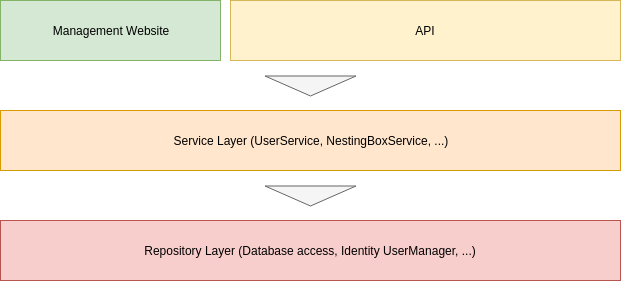

# Nesteo-Server 

Backend Server of the Nesteo nesting box management application for ringing associations. - [More Information](https://github.com/Nesteo/Nesteo)


**Useful links:**
- [Docker Image on Docker Hub](https://hub.docker.com/r/nesteo/server/tags)
- [ASP.Net Core documentation](https://docs.microsoft.com/aspnet/)

## Production Usage

### Install and execute

#### Requirements

Please make sure you're running an up to date Linux distribution and have Docker as well as Docker-Compose installed:
- [Install Docker on Debian](https://docs.docker.com/install/linux/docker-ce/debian/)
- [Install Docker on Ubuntu](https://docs.docker.com/install/linux/docker-ce/ubuntu/)
- [Install Docker-Compose](https://docs.docker.com/compose/install/)

#### Preparation

To get up and running, please clone this repository to your pc and open the repository directory with a terminal:
```
git clone https://github.com/Nesteo/Nesteo-Server.git
cd Nesteo-Server
```

Now use the `sample.env` as a template to create a `.env`-file to configure docker-compose:
```
cp sample.env .env
nano .env
```
Please replace the database password and exit the editor with `Crtl+O` and `Ctrl+X`.

After that create a file at `/root/nesteo/server/appsettings.json` based on `Nesteo.Server/appsettings-sample.json`:
```
mkdir -p /root/nesteo/server/
cp Nesteo.Server/appsettings-sample.json /root/nesteo/server/appsettings.json
nano /root/nesteo/server/appsettings.json
```
Please replace the database password here, too.

Now execute the following commands to setup your database:
```
docker-compose up -d nesteo-db
<< Wait a few seconds while the database starts >>
docker-compose exec -T nesteo-db mysql -u root --password=DATABASE-PASSWORD -e 'CREATE DATABASE nesteo COLLATE utf8_general_ci;'
cat database.sql | docker-compose exec -T nesteo-db mysql -u root --password=DATABASE-PASSWORD nesteo
```

#### Start

Now you can start all required services:
```
docker-compose up -d
```

In case you want to check the server logs, run `docker-compose logs -f`.

The backend is now available under `http://localhost`. See below for some useful URLs.

#### Stop

You can take all services down using:
```
docker-compose down
```

### Update

Before starting, take everything down:
```
docker-compose down
```

Now pull the latest changes:
```
git pull
docker-compose pull
```

And update your database:
```
docker-compose up -d nesteo-db
<< Wait a few seconds while the database starts >>
cat database.sql | docker-compose exec -T nesteo-db mysql -u root --password=DATABASE-PASSWORD nesteo
```

Now you can start the server as normal:
```
docker-compose up -d
```

### Important URLs

The server, when started, serves different services at different URLs:
- **/** - Management website
- **/api/v1** - The main API endpoint
- **/api-docs** - Fancy API documentation page
- **/swagger** - Swagger API testing tool
- **/swagger/v1/swagger.json** - Swagger API specification
- **/health** - Endpoint for health checks

### Default login credentials

When clicking *Authorize* in the API testing tool, you'll be asked for username and password.
These have been set to the following values on first server start:

**Username:** Admin

**Password:** Admin123

## Setup of a development environment

#### Install the .Net Core SDK

This server is built on top of the open source **.Net Core 3.0**. At the time of writing, version 3.0 is going to be released in a few days.
Please follow the installation instructions on the [.Net Core downloads page](https://dotnet.microsoft.com/download) to install the 3.0 SDK on your development machine.

#### Start database and server

To start developing on the server codebase, start with setting up your database as described above but skip the step for importing `database.sql`.
Instead of saving your modified `appsettings.json` to `/root/nesteo/...` put it into the project directory next to `appsettings-sample.json`.
Also don't run `docker-compose up -d` because it's sufficient when the database is running.

Now open `Nesteo.Server.sln` in the Jetbrains Rider IDE, add a *Run configuration* for the `Nesteo.Server` project and specify an environment variable called `ASPNETCORE_ENVIRONMENT` with `Development` as value.

Finally you should be able to startup the server and start hacking.

#### Install Entity Framework CLI tool

You need the `dotnet ef` cli tool to create database migrations and update your database (see below). Use this command to install it:
```
dotnet tool install --global dotnet-ef --version 3.0.0-*
```

## Development

#### Create database migrations

When you've done changes to the database structure you'll have to create a database migration to update your database and enable other users to update their's, too.

Execute this command in the solution root directory to list existing migrations:
```
dotnet ef --project=Nesteo.Server migrations list
```

To create a new migration:
```
dotnet ef --project=Nesteo.Server migrations add TitleOfMyChange
dotnet ef --project=Nesteo.Server migrations script --idempotent --output database.sql
```

Now update your own database:
```
dotnet ef --project=Nesteo.Server database update
```

In case you want to drop your database to clear all data, execute `dotnet ef --project=Nesteo.Server database drop` before doing the `update`.

Now you can start the server and work with the updated database structure.

#### Code structure

The main application code is split up into three layers:



- **Management Website & API:** This layer primarily consists of the API **Controllers** and the management website **Pages**. It only communicates with the interfaces of the service layer (for example `IUserService`) and doesn't know anything about implementation details of the service classes or the repository layer. The code inside of this layer should be focused only on simple user interface or API tasks like handling authorization or returning appropriate HTTP responses. Don't implement any application logic here, because it will not be well testable.
- **Service Layer:** All services are abstractly defined by interfaces and implemented by a "service class" that communicates with the repository layer to retrieve data or do data updates. The service layer contains the main application logic and doesn't know anything about the above layer. It uses a mapping library (`AutoMapper`) to map between "entity" types (from the service layer) and normal "model" types that are returned to the above layer.
- **Repository Layer:** This is anything that's directly related with databases and data storage. It's mostly implemented by a few entity classes and all the data management logic that's provided by Entity Framework Core. The user management, that's implemented using the inbuilt Identity framework, is also located here. This layer doesn't know anything about the above layers.

The dependencies of all implementation classes inside of these layers are resolved using a powerful Dependency Injection framework. This makes e.g. service implementations interchangeable and greatly improves code testability.
